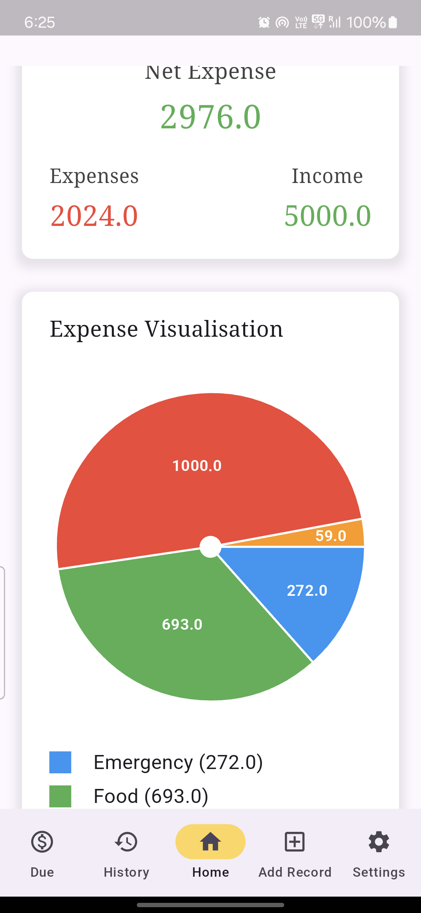
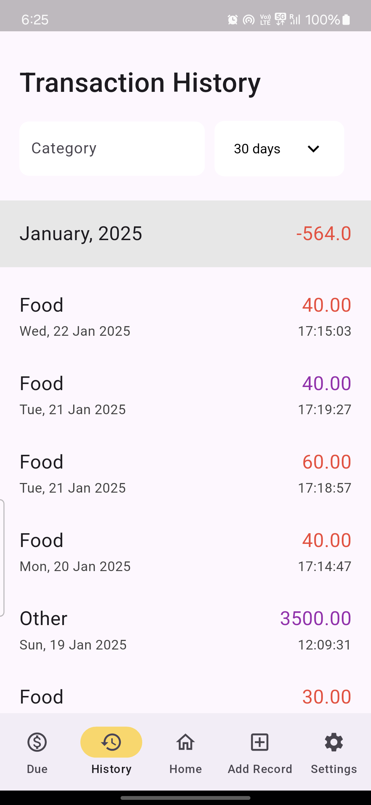
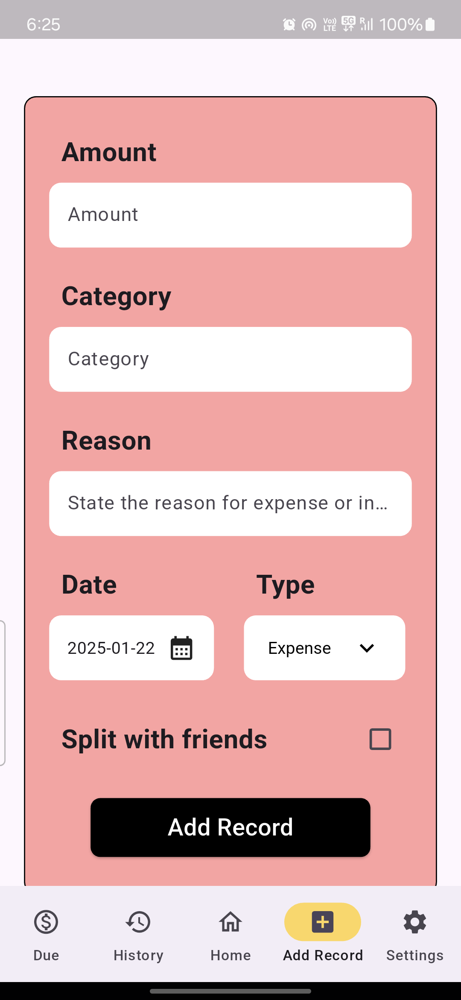
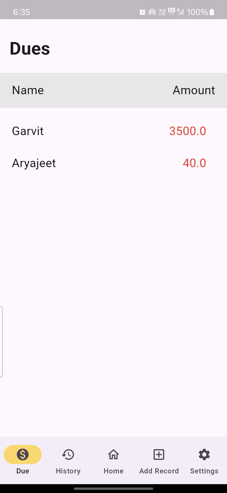
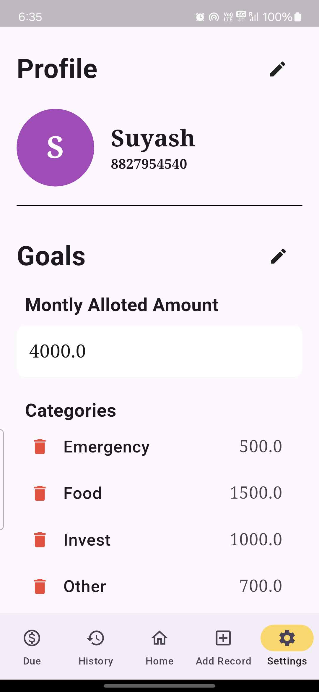

# Expense Tracker

A personal finance app built with Flutter to help you track and manage your income, expenses, and dues from friends. The app offers intuitive visualizations, transaction history, and a straightforward way to keep track of your financial goals.

## Features

### 1. Home Page
- Displays your **net expense**, **total income**, and **total expense**.
- Visualizes your spending patterns with a **category-wise breakdown**, showing which categories you spent the most money on.

### 2. Transaction History
- View a detailed history of all your transactions.
- See specific information like transaction date, amount, category, and more.

### 3. Add Record
- Easily add new transactions to track your expenses and income.
- Keep track of how much you owe to your friends and how much they owe you.

### 4. Due Page
- Shows a detailed view of how much each friend owes you.
- Tap on any friend to view a comprehensive breakdown of transactions that led to the amount they owe you.

### 5. Settings Page
- Update your profile details.
- Set financial **goals** and assign a **budget** to each expense category.

## Screenshots

    

        

            
        

        

            
        

        

            
        

    

    

    

        

            
        

        

            
        

    

## Backend

The backend is built using **Node.js** with **Express.js** to handle user authentication, database interactions, and transactional queries. It uses **MySQL** for storing user data, transactions, and related information.

### Key Features of the Backend:
1. **Authentication**:
   - Authentication for secure login and registration.
   - Users can sign up, log in, and authenticate through secure token-based mechanisms.
   - Password and other important data stored after bycrpting

2. **User Management**:
   - User profile management: Update details such as name, email, and budget preferences.
   - Change password functionality for enhanced security.

3. **Transactions**:
   - Users can add, update, or delete transactions.
   - Store transactions with information like date, amount, category, and associated user.
   
4. **Dues Management**:
   - Query how much a user owes or is owed by their friends.
   - Track detailed transaction history and amounts involved in dues.

### Database Structure:

1. **Users Table**: 
   
2. **Transactions Table**:
   
3. **Due Table**:

4. **Categories Table**;

## Security

### Frontend Security
To protect sensitive user data on the frontend:
- **Secure Storage**: Used **Flutter Secure Storage** to securely store user authentication tokens, sensitive financial information, and other important details on the user's device. This ensures that user data is stored in an encrypted manner and cannot be easily accessed by unauthorized users or apps.
  
- **AES Encryption**: To further secure sensitive data (like user credentials and transaction data), we have implemented **AES encryption** to encrypt certain data before storing it locally. This ensures that even if the device is compromised, the sensitive data remains unreadable without the appropriate decryption key.

### Backend Security  
- **Encrypted Database**: Passwords are hashed using **bcrypt** and stored in the **MySQL** database. This ensures that even if the database is breached, passwords remain secure.
